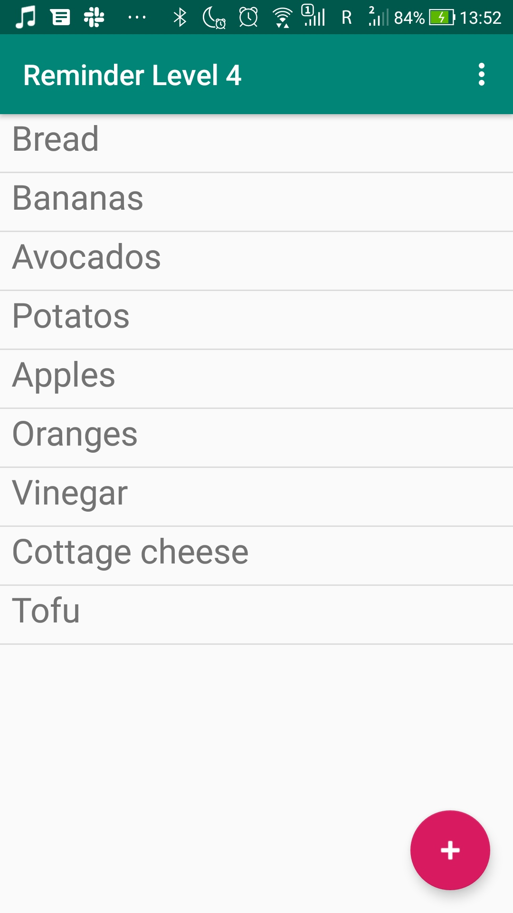

# Level 4 Example - Reminders App with local database
This is the example that was shown on the fourth seminar. The layout is the same as in the level 3 example. However, this time we have set a goal to store the reminder in the local database so when the user closes and reopens the application, his reminders are still there.
## What's inside
This is the app that can be used to write down your reminders. Basically, it's the same as the example for level 3. However, this time everything is saved in local Room database, and any changes to the list of the reminders are persisted even when the user closes and reopens the app. The database operations are also performed in the background IO thread (we use coroutines for that), so the user interface doesn't freeze if the database access operation takes too much time.
## Screenshots
    
